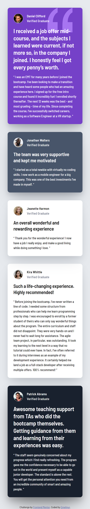

# Frontend Mentor - Testimonials Grid Section  


## Welcome! 👋  
This is my solution for the [**Frontend Mentor**](https://www.frontendmentor.io) challenge: **Testimonials Grid Section**.  
The goal was to recreate the design using **HTML** and **CSS Grid**, ensuring a **fully responsive layout** across all devices.

---

## 🚀 Live Demo & Code  
- **Solution URL:** [Frontend Mentor Solution](https://www.frontendmentor.io/solutions/testimonials-grid-section-main-fT2ml1bt9l)  
- **Live Site URL:** [GitHub Pages](https://emelinur.github.io/testimonials-grid-section-main/)  

---

## 🧰 Built With  

- Semantic **HTML5**  
- **CSS Grid** (main layout)  
- Responsive **media queries**  
- CSS **custom properties (variables)**  
- **Google Fonts** – _Barlow Semi Condensed_  

---

## 🧠 What I Learned  

This project helped me strengthen my understanding of **CSS Grid** and how to structure responsive layouts efficiently.

### Key Takeaways  

- Using `grid-template-areas` to define named layout regions  
- Applying `grid-template-columns` and `grid-template-rows` to build multi-column layouts  
- Understanding `grid-column: 2 / span 2;` and how it controls element width across tracks  
- Combining `gap`, `auto-fit`, and `minmax()` for flexible and scalable grids  
- Maintaining consistent spacing and card proportions across devices  

### Resources I Used  

- [W3Schools – CSS Grid](https://www.w3schools.com/css/css_grid.asp)  
- [YouTube Tutorial](https://youtu.be/T01NU_rxjgY?si=Lhxq4U7IML59N4zy)  
- Debugging and guidance with **ChatGPT** 💬  

---

## 📸 Screenshots  

| Desktop                          | Mobile               |
| -------------------------------- | -------------------- |
|  |  |

---

## 🧩 How to Run Locally  

```bash
# Clone the repository
git clone https://github.com/Emelinur/testimonials-grid-section-main.git

# Open the project folder
cd testimonials-grid-section-main

# Then open index.html in your browser

